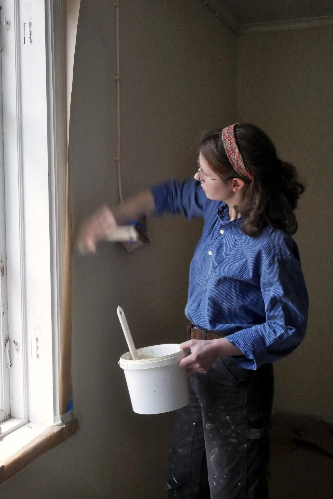

## Om mig

Efter ett treårigt kandidatprogram på kulturvårdsinstitutionen med inriktning mot traditionella hantverksmetoder (bygghantverksprogrammet) läste jag Kulturmålare - traditionellt byggnadsmåleri. Nu utför jag hantverksjobb och erbjuder rådgivning, främst i Mariestad med omnejd men reser gärna. Parallelt med hantverksuppdragen arbetar jag även just nu med ett eget projekt där jag utforskar marmorering och olika enkla färgtyper, ett projekt som ska leda till att jag tar fram nytt kursmaterial till nybörjarkurser.

## Tjänster

Sedan examen har jag främst arbetat med pappspänning, lumppapp, limfärg, äggoljetempera, interiört linoljefärgsmåleri, lerklining, rödfärgsmålning, rådgivning och restaurering av äldre ytskikt, men mina intressen är många. Kontakta mig gärna angående arbeten som exempelvis:

### Teknisk rådgivning på plats eller digitalt

Rådgivning kring både ytskikt och andra aspekter av äldre hus, om det sträcker sig utanför min kompetens har jag kontakt med många olika restaureringshantverkare som tillsammans har ett otroligt brett spann av kompetenser. Jag älskar att diskutera projekt och ge rådgivning utifrån min kompetens, det är något jag verkligen önskar ägna mig mer åt och utvecklas i så under 2026 kommer jag att erbjuda rabatt på den typen av tjänst.

Jag har även en idé om att prova digital rådgivning till ett ännu mer rabatterat pris så tveka inte att höra av dig även om du bor långt från Mariestad.

### Traditionellt måleri och restaurering

- Restaurering av äldre ytskikt, t.ex. fläckar efter vattenskador eller skador på träådringar m.m.
- Olika typer av limfärg
- Äggoljetempera och emulsionsfärg
- Schablonmålning dekormåleri och stänkmålning
- Pappspänning
- Lerklining
- Putslagningar
- Tapetsering med lumppapp eller papperstapet
- Oljeförgyllning
- Marmoreringar och träådringar
- Ommålning av möbler
- Slamfärg
- Linoljefärgsmåleri interiört och exteriört
- Fönsterrenovering

### Rådgivning och stöd i eget projekt

Planerar du ett eget projekt i ett äldre hus och är osäker på hur du ska gå tillväga? Presentera det för mig så går vi tillsammans igenom ditt projekt och diskuterar aspekter som:

- Vilka material och tekniker som kan passa just dina ytor
- Vilket förarbete som kan vara lämpligt
- En lämplig ordning för olika arbeten
- Vad som vore tidstypiskt för ditt hus, främst rent tekniskt men även färgsättning och andra stilmässiga aspekter
- Vad som finns eller funnits där tidigare och hur vi kan förhålla oss till det
- Andra antikvariska aspekter som till exempel att spara tidslager och arbeta reversibelt

Vi går igenom antikvariska aspekter så att vi kan göra medvetna val och undvika att kulturlager raderas utan eftertake, men jag kommer även att påminna dig om att det är du som ska trivas i ditt hem. Mitt mål är att stärka dig i ditt projekt och hjälpa dig förbi fällor om vad som är "rätt och fel".

Jag kan även hjälpa dig att praktiskt komma igång med ditt egna projekt, planera inköp och ge tips inför arbetet.

### Kurser och workshops

Jag erbjuder kurser både för grupper och för dig som önskar hjälp med ditt hemmaprojekt men vill utföra merparten av arbetet själv.

## Kontakt

Jag finns i Mariestad med omnejd. För förfrågningar och samarbeten, kontakta mig via e-post.

**E-post:** [kajsa.smoliansky@gmail.com](mailto:kajsa.smoliansky@gmail.com)

**Instagram:** [@smoliansky](https://www.instagram.com/smoliansky/)
