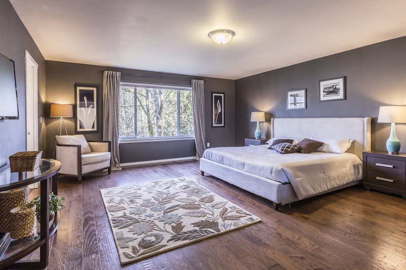

I en sekelskifteslägenhet skulle innertaken målas om. Taken hade tidigare målats med limfärg och det var viktigt att fortsätta med samma teknik.

## Varför limfärg?

Limfärg är en traditionell teknik som ger en vacker matt yta som andas. Den fungerar utmärkt på äldre puts och kalkunderlag. Att måla med modern plastfärg på ytor som tidigare haft limfärg kan ge problem med flagning och fukt.

## Genomförande

Först tvättades taken för att ta bort damm och löst sittande färg. Sedan grundades ytan innan själva limfärgen ströks på i flera tunna lager.

## Resultat

Resultatet blev en jämn, vacker yta med den karakteristiska matta lyster som limfärg ger.

