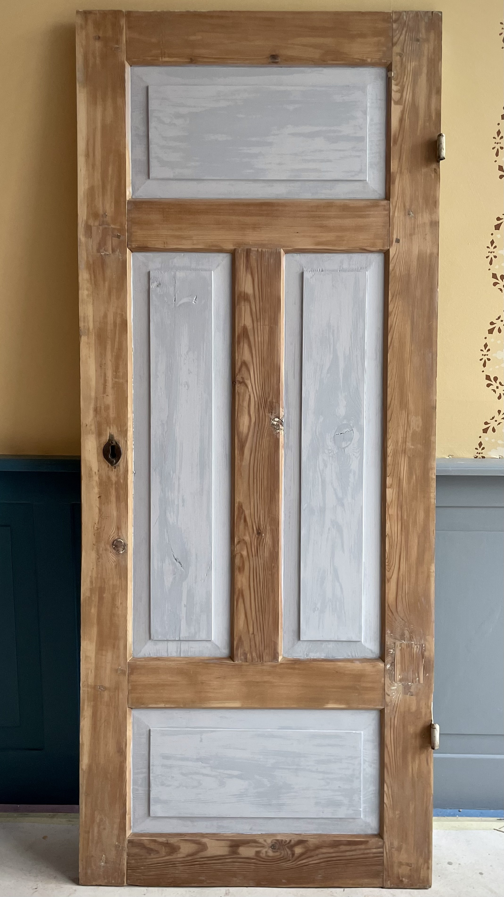
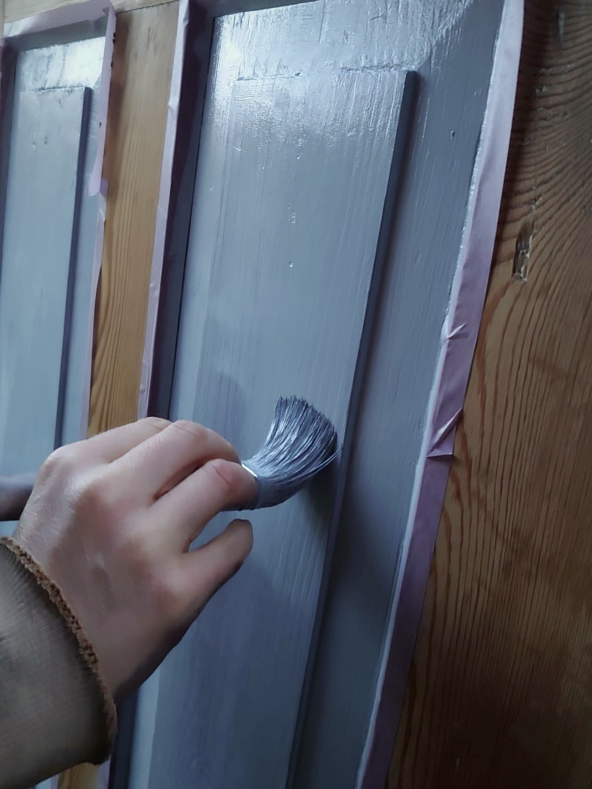
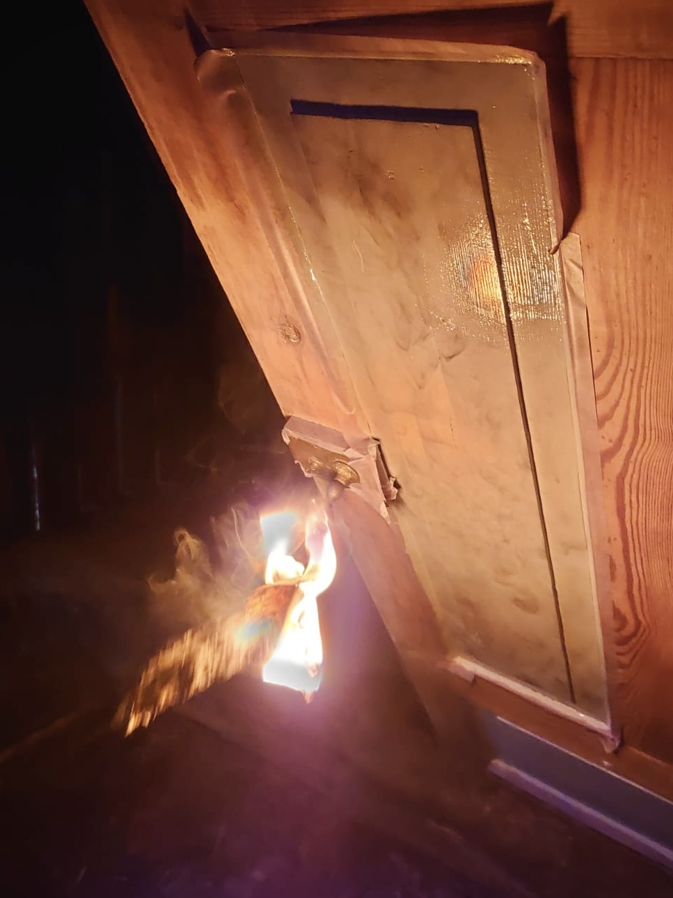
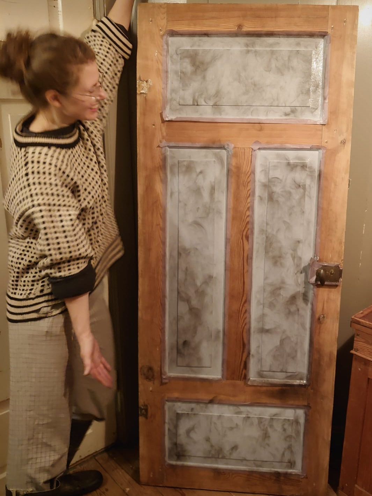
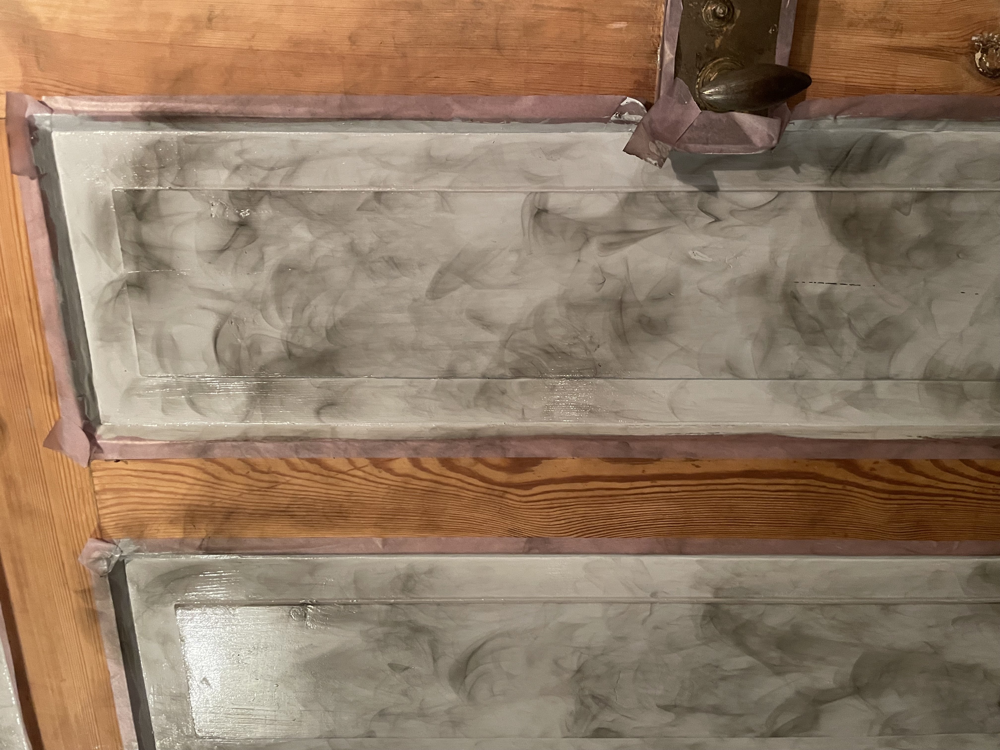

## Ett eget litet projekt som jag lekte med hemma

Först grundmålade jag dörrspeglarna med en hemgjord linoljefärg bruten med hemgjord kimrök. I mitt examensarbete på kulturmåleriutbildningen undersökte jag kimrök som pigment. Jag blandade linoljefärger med kimrök av olika ursprung, denna kimrök är gjord på soten från björknäver och det kändes passande att marmorera den med mer sot från björknäver. När första lagret färg torkat förberedde jag stora bitar björknäver att tända eld på och strök ett till lager linoljefärg på speglarna, som direkt i vått tillstånd hölls över röken från den brinnande nävern.

