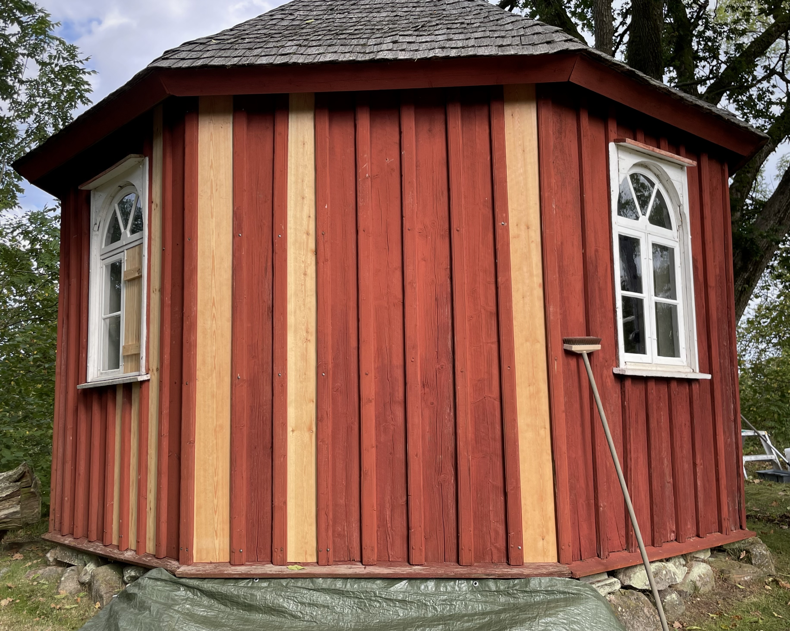
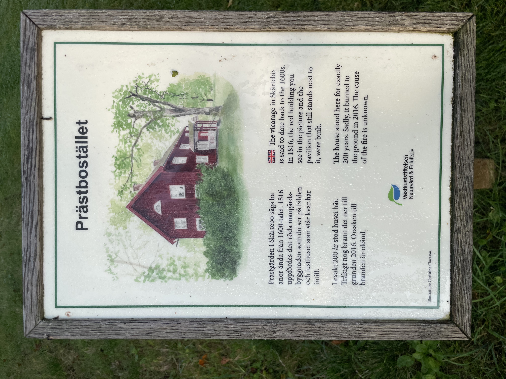
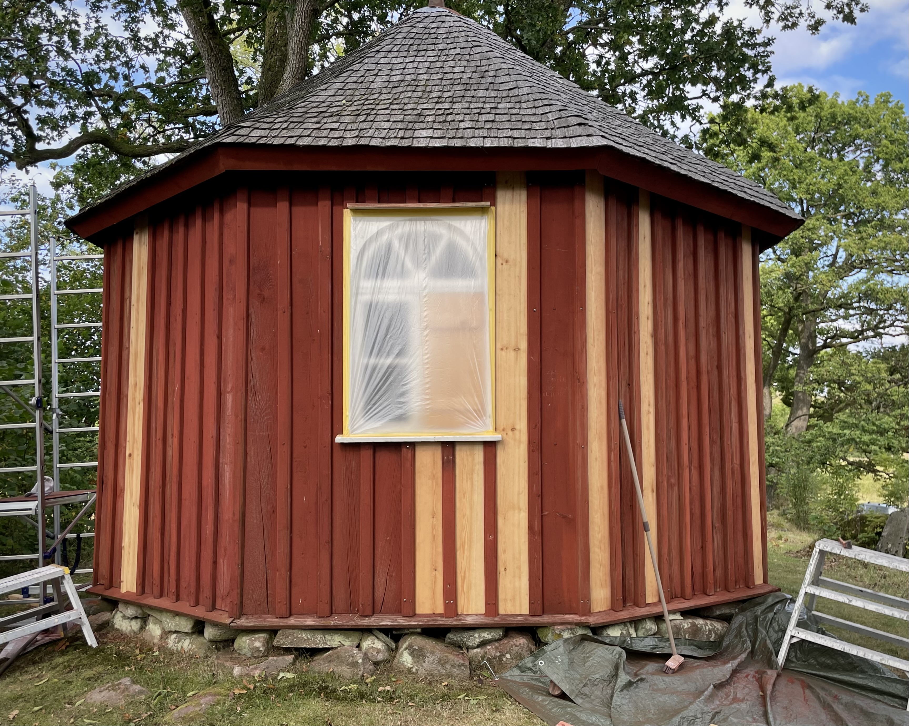
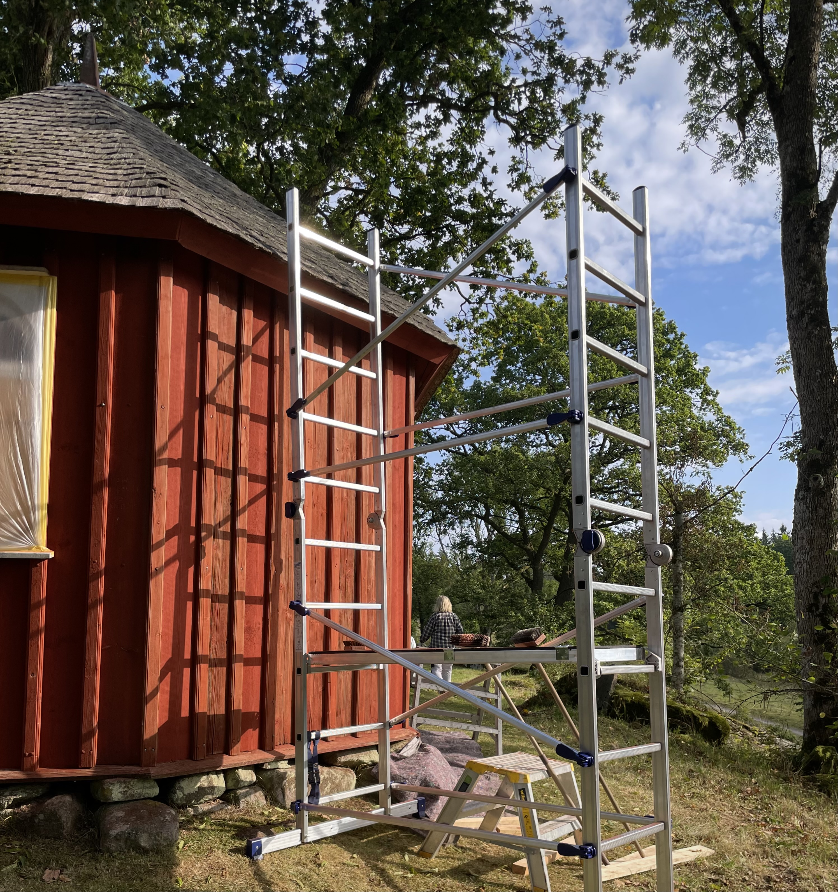
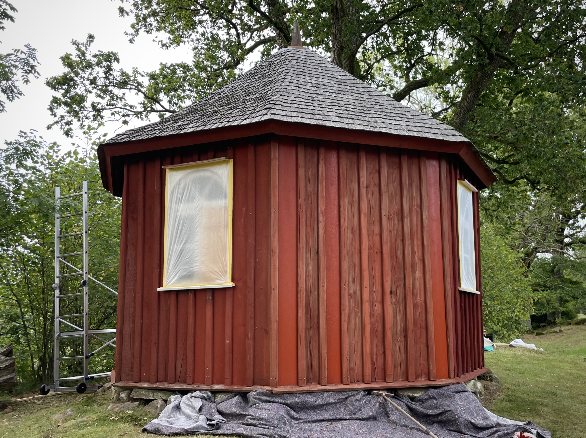
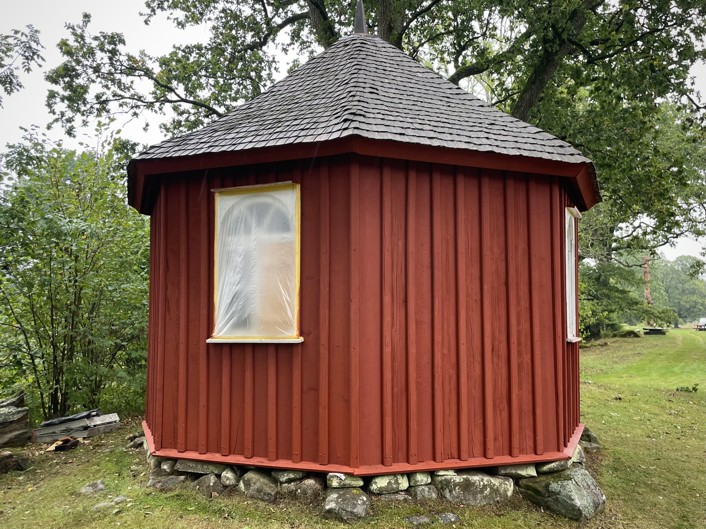
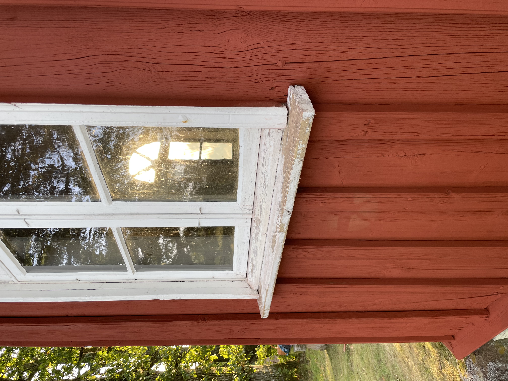

## Ett otroligt mysigt litet jobb i vacker miljö

Detta gjorde jag tillsammans med Lisbeth Frost. Vi borstade de tidigare slamfärgsmålade väggarna och tvättade det linoljefärgsmålade: entrén och fönster. Sedan målade vi allt utbytt, omålat virke, och sedan resten av fasaden.

